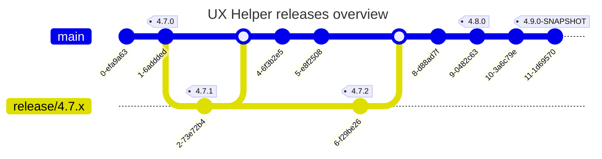
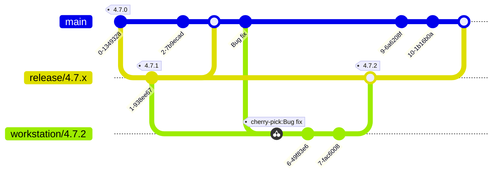

# Release steps

## Pre-release

- For pre-release testing or verifying functionality of the latest version -SNAPSHOT builds can be used
- Every commit on main:
    - Finds the last version from the VERSION file e.g. 4.7.0 bumps the minor version e.g. 4.8.0
    - Generates a build for Maven Central in the format 4.8.0-SNAPSHOT
    - (TODO) Tags the latest commit on main with the snapshot version e.g. 4.8.0-SNAPSHOT

## Major / Minor version release

1. Run the workflow called "Create draft release" which will:
    - Open a PR targeting main branch
2. Once tested and approved by the relevant owners, merge the PR to main
3. Once merged the following will occur:
    - Update changelog - unreleased section moved to correct version number
    - Build uploaded to Maven Central
    - Release made on Github with relevant build files
    - Commit tagged with version number

## Hotfix / patch version release

Hotfix / patch version e.g. releases that increase Z in the format X.Y.Z consist of one or more bug fixes but do not introduce or change functionality.

1. Find and create a working branch from the tagged commit you need to patch either:
    - On the main branch for the first patch commit
    - On a floating release branch with name in the format "release/4.7.x" for subsequent patches
2. On your working branch make the required changes
3. Create a pull request that targets the relevant release branch with name in the format "release/4.7.x"
4. Approve and merge the pull request.
5. (TODO) Once merged the following will occur:
    - Build uploaded to Maven Central
    - Release made on Github with relevant build files
    - Commit tagged with version number
