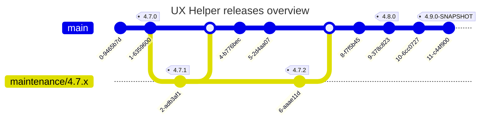
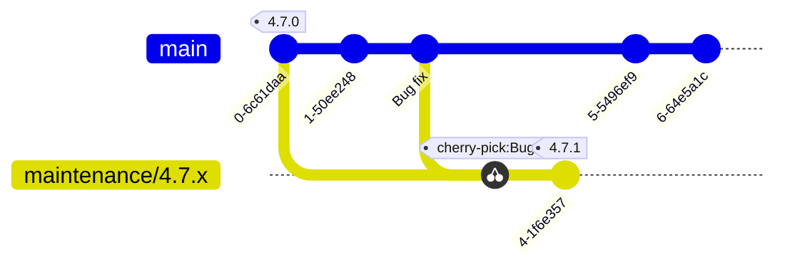

# Release steps

```mermaid
---
title: UX Helper releases overview
---

gitGraph
    commit
    commit tag: "4.7.0"
    branch maintenance/4.7.x
    checkout maintenance/4.7.x
    commit tag: "4.7.1"
    checkout main
    merge maintenance/4.7.x
    commit
    commit
    checkout maintenance/4.7.x
    commit tag: "4.7.2"
    checkout main
    merge maintenance/4.7.x
    commit
    commit tag: "4.8.0"
    commit
    commit tag: "4.9.0-SNAPSHOT"
```

## Pre-release

- For pre-release testing or verifying functionality of the latest version -SNAPSHOT builds can be used
- Every commit on main:
    - Finds the last version from the VERSION file e.g. 4.7.0 bumps the minor version e.g. 4.8.0
    - Generates a build for Maven Central in the format 4.8.0-SNAPSHOT
    - Tags the latest commit on main with the snapshot version e.g. 4.8.0-SNAPSHOT

## Major / Minor version release

1. Run the workflow called "Release – Draft" against the `main` branch which will:
    - Open a PR targeting `main`
    - Auto-generate `CHANGELOG.md` from git history (conventional commit PR titles)
2. Once tested and approved by the relevant owners, merge the PR to `main`
3. Once merged the following will occur:
    - Update changelog - unreleased section moved to correct version number
    - Release made on Github with relevant build files
    - Commit tagged with version number

## Pre-release / qualified versions (rc, alpha, beta)

To cut a qualified release such as `1.0.0-rc1` or `0.10.0-alpha2`:

1. Run "Release – Draft" and fill in:
    - `bump-type`: `patch`, `minor`, or `major` for the base bump, OR `none` to
      keep the current base unchanged and only change the qualifier. Use cases
      for `none`:
        - Re-qualify an existing pre-release (`0.10.0-rc1` → `0.10.0-rc2`, by
          dispatching with `bump-type=none`, `qualifier=rc2`).
        - Finalise a pre-release (`0.10.0-rc2` → `0.10.0`, by dispatching with
          `bump-type=none` and an **empty** `qualifier`).
    - `qualifier`: the pre-release identifier to append, **without the leading
      hyphen** (e.g. `rc1`, `alpha2`, `beta`). Leave blank for a stable release.
      Must start with an alphanumeric; allowed characters thereafter:
      alphanumerics, dot, hyphen.

    The workflow rejects combinations that would produce a version identical
    to the current `VERSION` (no-op).

2. Approve and merge the resulting PR into the branch the workflow was dispatched
   from.
3. Once merged the `Release – Publish` workflow will:
    - Publish to Maven Central with the qualified version.
    - Create a GitHub release marked as pre-release and **not** marked as
      "Latest" so the stable release keeps the badge.
    - Tag the commit with the qualified version (e.g. `1.0.0-rc1`).

## CHANGELOG.md

`CHANGELOG.md` is generated automatically by the `Release – Draft` workflow from the git history (conventional commit PR titles). **Do not edit `CHANGELOG.md` in feature branches** — any manual entries will be overwritten when the release PR is drafted. Write clear, conventional commit-style PR titles (e.g. `feat(catalog-dropdown): use icon font markers`) and the changelog entry will be produced for you at release time.

## Hotfix / patch version release

Hotfix / patch version e.g. releases that increase Z in the format X.Y.Z consist of one or more bug fixes but do not introduce or change functionality.

```mermaid
gitGraph
    commit tag: "4.7.0"
    branch maintenance/4.7.x
    checkout main
    commit
    commit id: "Bug fix"
    checkout maintenance/4.7.x
    cherry-pick id:"Bug fix"
    commit tag: "4.7.1"
    checkout main
    commit
    commit
```

1. Find and create a maintenance branch in the format `maintenance/X.Y.x` (e.g.
   `maintenance/4.7.x`) from the tagged commit you need to patch. After a major
   release such as `1.0.0`, create `maintenance/1.0.x` from the stable release
   tag or release commit.
2. On the maintenance branch, make or cherry-pick the required changes.
3. Run "Release – Draft" **with the branch selector set to `maintenance/4.7.x`**
   (the "Use workflow from" dropdown). The draft workflow respects the dispatch
   branch and will:
    - Check out, bump, and changelog against `maintenance/4.7.x`.
    - Open a PR targeting `maintenance/4.7.x` (not `main`).
    - Reject `minor` and `major` bumps on maintenance branches.
4. Approve and merge the resulting `release-prep/...` PR into the maintenance
   branch.
5. Once merged, `Release – Publish` will run from `maintenance/4.7.x` and:
    - Upload the build to Maven Central.
    - Create a GitHub release with the relevant build files. Maintenance
      releases are not marked as GitHub "Latest"; only stable releases from
      `main` update the latest release badge.
    - Tag the commit with the version number (e.g. `4.7.2`).

> [!NOTE]
> `Release – Publish` is triggered by pushes to `main`, `maintenance/*`, and
> `workstation/*` branches only. Any other branch (e.g. `feat/...`,
> `chore/...`) will not publish.
>
> Snapshot version logic:
>
> - On `maintenance/*` and `workstation/*`, snapshots use a `patch` bump from
>   the current `VERSION` (so `maintenance/4.7.x` at VERSION `4.7.1` produces
>   `4.7.2-SNAPSHOT`).
> - On `main`, snapshots use a `minor` bump (VERSION `4.7.1` → `4.8.0-SNAPSHOT`).
> - If `VERSION` is already a pre-release (e.g. `1.0.0-rc1`), snapshots track
>   the in-progress stable and emit `1.0.0-SNAPSHOT` instead of bumping further.
>
> The PR branch created by `Release – Draft` is named `release-prep/<version>`
> so it does not collide with workstation or release branches.
> `Release – Draft` can only run from `main`, `maintenance/*`, or
> `workstation/*` branches.
